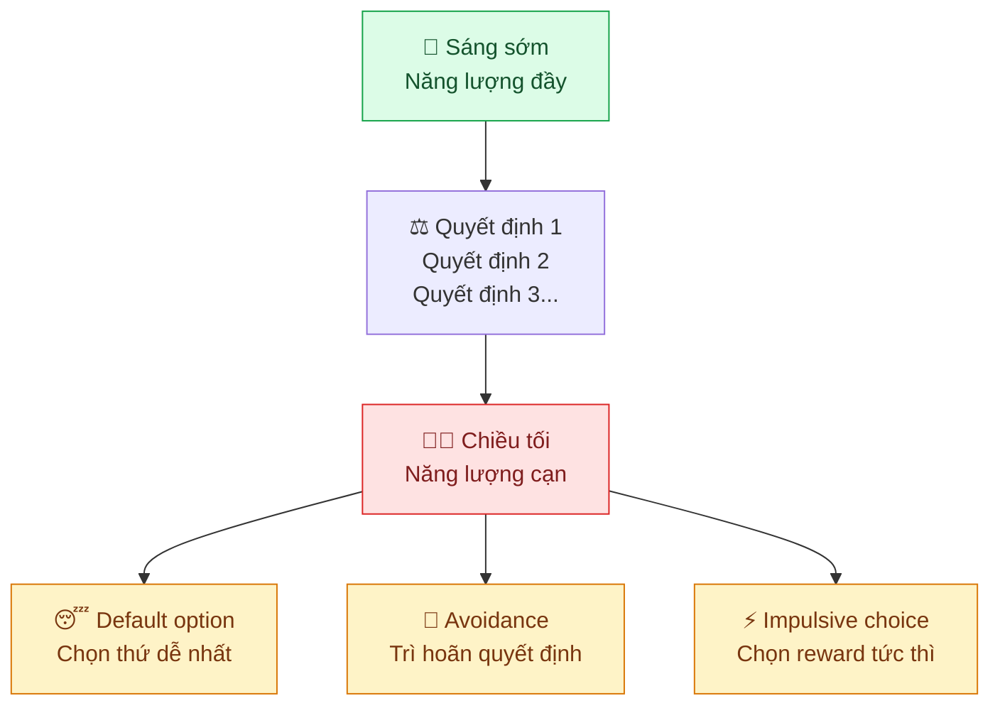

---
parents:
  - "[[Metalearning.canvas]]"
tags:
  - Metalearning
sources:
  - https://doi.org/10.1073/pnas.1018033108
  - https://doi.org/10.1037/0022-3514.74.5.1252
aliases:
  - Mệt mỏi quyết định
publish: "true"
---

> [!NOTE]
> **Decision Fatigue**: chất lượng quyết định suy giảm sau mỗi lần ra quyết định: não dùng cùng một nguồn lực nhận thức cho mọi lựa chọn, từ chọn quần áo đến quyết định chiến lược. Càng nhiều quyết định trong ngày, quyết định sau càng tệ hơn hoặc bị né tránh hoàn toàn.

## Cơ chế: Ý chí như năng lượng có hạn

Baumeister (1998) đề xuất mô hình **Ego Depletion**: willpower và khả năng ra quyết định chia sẻ cùng một nguồn lực tâm lý: khi nguồn này cạn, cả hai đều suy giảm.

Khi decision fatigue xuất hiện, não có 3 lối thoát:

| Lối thoát | Biểu hiện | Hậu quả |
|---|---|---|
| **Default** | Chọn phương án mặc định, status quo | Bỏ lỡ lựa chọn tốt hơn |
| **Avoidance** | Trì hoãn, "để mai tính" | Tích lũy quyết định → càng nặng hơn |
| **Impulsive** | Chọn cái có reward ngay lập tức | Quyết định không phù hợp với mục tiêu dài hạn |

> [!example]
> 7h tối sau một ngày dày đặc meetings: bạn định nấu ăn lành mạnh (quyết định phức tạp), nhưng cuối cùng gọi đồ ăn fast food (default + impulsive). Không phải thiếu ý chí: là hết ngân sách nhận thức.

## Hai dạng quyết định tiêu hao khác nhau

Không phải mọi quyết định đều hao như nhau:

**Tiêu hao nhiều:**
- Quyết định có nhiều lựa chọn tương đương (khó so sánh)
- Quyết định liên quan đến trade-off (phải từ bỏ thứ gì đó)
- Quyết định với hậu quả không chắc chắn
- Quyết định có tính đạo đức hoặc cảm xúc

**Tiêu hao ít:**
- Quyết định theo thói quen, đã có tiền lệ
- Quyết định theo rule đã đặt trước (implementation intention)
- Quyết định khi chỉ có 1–2 lựa chọn rõ ràng

> [!warning]
> **Bẫy "nhỏ cũng tốn"**: chọn cà phê sáng, chọn bài nhạc, reply email nhanh: từng cái nhỏ nhưng cộng lại tiêu hao đáng kể trước khi bạn đến được quyết định quan trọng nhất trong ngày.

## Nghiên cứu quan trọng

**Danziger, Levav & Avnaim-Pesso (2011): Thẩm phán Israel:**

Phân tích **1.112 phiên xét xử** xin ân xá của tù nhân. Kết quả gây sốc:

- Đầu buổi sáng (sau nghỉ ngơi): tỉ lệ chấp thuận ân xá **~65%**
- Cuối phiên (trước giờ nghỉ): tỉ lệ chấp thuận **~10%**
- **Ngay sau khi ăn uống nghỉ giải lao**: tỉ lệ nhảy vọt trở lại ~65%

Thẩm phán không cố ý kỳ thị: họ đơn giản đang bị decision fatigue. Khi mệt, não chọn phương án an toàn nhất: **từ chối** (giữ nguyên status quo).

---

**Baumeister, Bratslavsky, Muraven & Tice (1998): Ego Depletion gốc:**

Nhóm A phải kháng cự ăn bánh quy hấp dẫn (tiêu hao willpower), sau đó được cho giải câu đố khó. Nhóm B không phải kháng cự gì.

Kết quả: **Nhóm A bỏ cuộc sớm hơn đáng kể** khi gặp câu đố khó: dù đây là task hoàn toàn khác, chỉ dùng chung "nguồn lực" tâm lý.

---

**Vohs et al. (2008): Mua xe và decision fatigue:**

Khách hàng cấu hình xe hơi theo thứ tự khác nhau: nhóm phải quyết định màu sắc, vải ghế trước (nhiều lựa chọn tầm thường) bị fatigue sớm hơn và **chấp nhận gói mặc định nhiều hơn** ở các tùy chọn sau: dù gói mặc định đắt tiền hơn.

> Người bán hàng khôn ngoan đặt câu hỏi dễ trước để tạo ra fatigue, rồi giới thiệu upsell ở cuối.

---

**Lưu ý về replication (Inzlicht & Schmeichel, 2012):**

Một số nghiên cứu ego depletion không replication được ổn định: đặc biệt khi thay đổi điều kiện thí nghiệm. Bức tranh hiện tại: **Decision fatigue là thật và đo được** (nghiên cứu thẩm phán, nghiên cứu thực địa), nhưng cơ chế "nguồn lực cạn kiệt như pin" có thể đơn giản hóa quá mức: yếu tố motivation và expectation cũng đóng vai trò quan trọng.

## Ứng dụng: Giảm tải quyết định có chủ đích

### 🕗 Bảo vệ buổi sáng

Quyết định quan trọng nhất nên được làm trong **2–3 giờ đầu ngày**, trước khi bất kỳ quyết định nhỏ nào kịp tiêu hao ngân sách.

Obama, Zuckerberg, Jobs đều nổi tiếng với việc mặc cùng một kiểu quần áo mỗi ngày: không phải quirk cá nhân, mà là **loại bỏ một quyết định vô nghĩa** để giữ ngân sách cho thứ quan trọng hơn.

### 📋 Biến quyết định thành rule

Thay vì quyết định lại từ đầu mỗi lần, đặt rule một lần:

- *"Thứ Hai, Tư, Sáu tôi tập gym lúc 7h"*: không cần quyết định mỗi buổi sáng
- *"Trước 10h không check email"*: loại bỏ chuỗi micro-decision liên tục
- *"Nếu không chắc, chọn đơn giản hơn"*: rule cho quyết định mờ nhạt

Đây chính là cơ chế **Implementation Intention** của Gollwitzer: thay thế quyết định real-time bằng quyết định đã được pre-commit từ trước.

### 🔋 Nạp lại giữa ngày

- Ăn uống (glucose ảnh hưởng trực tiếp đến chất lượng quyết định: nghiên cứu thẩm phán)
- Nghỉ ngắn 10–15 phút giữa các block quyết định lớn
- Đi bộ, vận động nhẹ: reset prefrontal cortex

### 🗑️ Giảm tổng số quyết định

Mỗi lựa chọn bạn loại bỏ khỏi ngày = thêm ngân sách cho quyết định quan trọng:

- Chuẩn bị outfit tuần trước
- Meal prep để không phải nghĩ "ăn gì hôm nay"
- Dùng template thay vì viết lại từ đầu
- Automate bill, subscription, routine purchases

---

## Liên hệ

- **[[Energy Management]]**: decision fatigue là biểu hiện trực tiếp của cognitive energy cạn kiệt
- **[[Temporal Motivation Theory]]**: Impulsiveness (Γ) trong công thức TMT tăng cao khi decision fatigue: não fatigued discount delay nặng hơn và chọn reward tức thì
- **[[Immediate and delayed Return Environment]]**: fatigue đẩy não về chế độ Immediate Return: chọn thứ dễ chịu ngay, bỏ qua mục tiêu dài hạn
- **[[Procrastination]]**: avoidance là một trong 3 lối thoát của decision fatigue; nhiều "procrastination" thực ra là não từ chối quyết định vì hết ngân sách
- **[[Thói quen]]**: thói quen = zero decision cost; xây thói quen tốt = giải phóng ngân sách nhận thức cho quyết định không thể routine hóa
- **[[Working Memory Và Long Term Memory]]**: working memory bị chiếm dụng bởi nhiều quyết định mở song song làm giảm chất lượng xử lý tổng thể
- **[[Focused mode và diffuse mode]]**: khó vào focused mode khi decision fatigue cao; não liên tục drift về distraction có reward immediate
