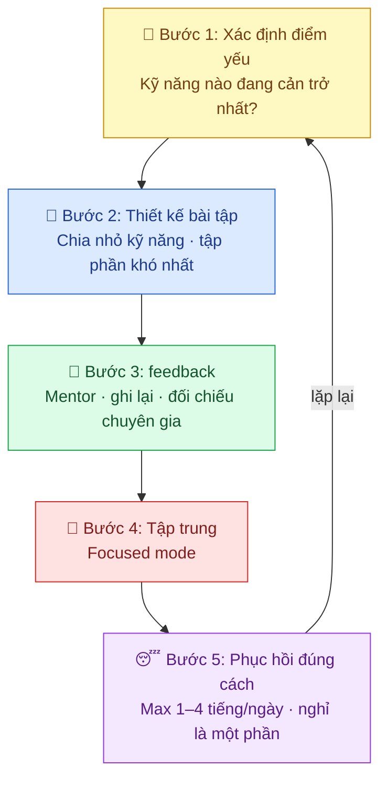

---
parents:
  - "[[Metalearning.canvas]]"
tags:
  - Metalearning
aliases:
  - Luyện tập có chủ đích
publish: true
---

> [!NOTE]
> **Deliberate Practice** là phương pháp luyện tập **tập trung vào điểm yếu**, có phản hồi tức thời, và liên tục đẩy bản thân ra ngoài vùng thoải mái, thay vì chỉ lặp đi lặp lại những gì đã giỏi.

Được nghiên cứu bởi **Anders Ericsson** (tác giả cuốn *Peak*), đây là điều thực sự phân biệt người giỏi với người xuất sắc, không phải tài năng, không phải số giờ luyện tập đơn thuần.

## Luyện tập thường vs Deliberate Practice

Hầu hết mọi người luyện tập theo kiểu **naive practice**: làm đi làm lại những thứ mình đã quen, cảm thấy thoải mái, rồi tự hỏi tại sao không tiến bộ.

| | Naive Practice 😴 | Deliberate Practice 🎯 |
|---|---|---|
| **Mục tiêu** | "Luyện tập thêm" | Cải thiện điểm yếu cụ thể |
| **Trạng thái** | Thoải mái, tự động | Tập trung cao độ, khó chịu |
| **Phản hồi** | Không có hoặc mơ hồ | Ngay lập tức và rõ ràng |
| **Tiến bộ** | Chững lại sau một thời gian | Liên tục cải thiện |

> [!example]
> - Một người chơi đàn luyện tập 2 tiếng mỗi ngày bằng cách chơi lại những bài đã thuộc → **Naive Practice**. 
> - Còn người chơi 1 tiếng nhưng liên tục tập đúng đoạn khó, xem lại từng lỗi sai, chủ động sửa → **Deliberate Practice**.

## 4 Yếu tố cốt lõi

### 1. 🎯 Mục tiêu cụ thể, kéo dài

Không phải "tập cho giỏi hơn" mà là "hôm nay tập đúng vào kỹ năng X, cải thiện điểm yếu Y". Mỗi buổi tập phải có mục tiêu đo được.

### 2. 🔥 Ra ngoài vùng thoải mái

Deliberate Practice **phải khó chịu**. Nếu bạn đang thoải mái, bạn đang không tiến bộ. Não chỉ hình thành [[neural pathways]] mới khi bị thử thách.

> [!quote]
> "*If you never push yourself beyond your comfort zone, you will never improve*." 
> 
> Anders Ericsson 

### 3. 📡 Phản hồi tức thời (Immediate Feedback)

Bạn cần biết ngay mình đang đúng hay sai, đang tốt hơn hay tệ hơn. 
Không có phản hồi = không có Deliberate Practice.

### 4. 🧠 Xây dựng Mental Representations

Chuyên gia không chỉ giỏi kỹ năng mà họ có **mô hình tinh thần** (mental representation) rất rõ về "giỏi trông như thế nào". Khi chơi cờ, họ nhìn bàn cờ và thấy cả một cấu trúc không phải từng quân riêng lẻ. Deliberate Practice xây dựng cái này dần dần.

## Hiểu đúng về 10,000 giờ

[[Practice Makes Permanent]] có nhắc đến 10,000 giờ nhưng đây là điểm thường bị hiểu sai:

> [!warning]
> - 10,000 giờ **naive practice** = giậm chân tại chỗ
> - 10,000 giờ **deliberate practice** = đẳng cấp thế giới

`Ericsson` nghiên cứu các nghệ sĩ `violin` tại Berlin và phát hiện: điều phân biệt sinh viên xuất sắc với sinh viên bình thường **không phải tổng số giờ luyện tập**, mà là số giờ **deliberate practice** luyện tập một mình, tập trung cao độ, tập đúng điểm yếu.

## Cách áp dụng

---

## Mối liên hệ với các phương pháp học khác

- **[[Growth Mindset]]** nền tảng tư duy để chấp nhận sự khó chịu khi luyện tập
- **[[Focused mode và diffuse mode]]** Deliberate Practice cần focused mode hoàn toàn
- **[[Chunking]]** chia nhỏ kỹ năng để tập từng phần là bước đầu của Deliberate Practice
- **[[Active recall]]** một dạng Deliberate Practice cho việc ghi nhớ kiến thức
- **[[Định luật yerkes-dodson]]** vùng tối ưu để tập luyện: không quá dễ, không quá khó

