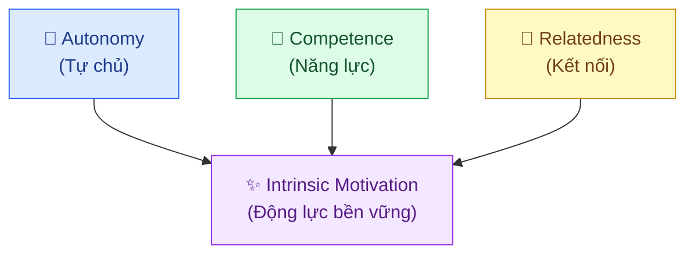
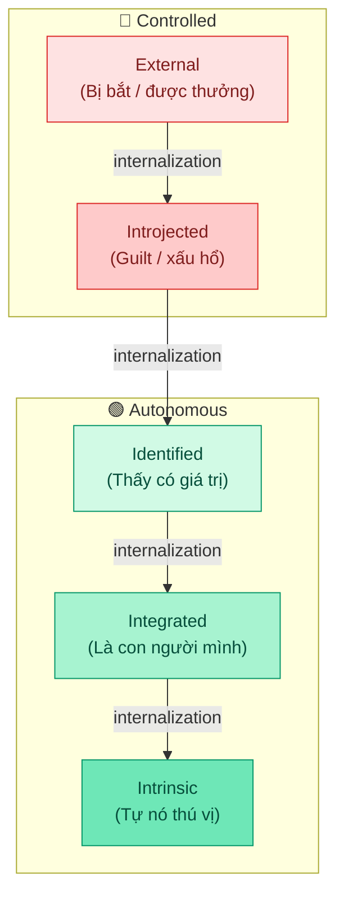

---
parents:
  - "[[Metalearning.canvas]]"
tags:
  - Metalearning
sources:
  - https://selfdeterminationtheory.org
aliases:
  - SDT
  - Lý thuyết tự quyết
publish: "true"
---

> [!NOTE]
> **Self-Determination Theory**: động lực bền vững không đến từ phần thưởng bên ngoài, mà đến từ việc thỏa mãn **3 nhu cầu tâm lý cơ bản**: Autonomy, Competence, Relatedness. Khi cả 3 được đáp ứng, intrinsic motivation xuất hiện tự nhiên.

## 3 Nhu cầu tâm lý cơ bản

### 1. Autonomy: Tự chủ

Cảm giác rằng hành động của mình **xuất phát từ chính mình**, không phải bị ép buộc.

Đây không phải là độc lập hay cô đơn, bạn vẫn có thể làm theo yêu cầu của người khác và vẫn cảm thấy autonomous, nếu bạn *hiểu lý do và đồng thuận*.

> [!example]
> Học sinh bị ép học toán (controlled) vs. học sinh tự chọn học toán vì thấy nó có ích (autonomous) — dù hành vi giống nhau, trải nghiệm tâm lý hoàn toàn khác nhau. Nhóm thứ hai học sâu hơn, nhớ lâu hơn, ít kiệt sức hơn.

### 2. Competence: Năng lực

Cảm giác **có hiệu quả**: rằng mình đang tiến bộ, có khả năng đạt được kết quả. Không phải là giỏi thực sự, mà là cảm giác đang làm chủ được thách thức.

> Competence bị phá vỡ khi: feedback quá tiêu cực, không có feedback nào, hoặc task quá dễ/khó so với năng lực hiện tại.

### 3. Relatedness: Kết nối

Cảm giác **thuộc về** một cộng đồng, được người khác quan tâm và mình cũng quan tâm lại. Trong học tập: có mentor, có study group, có người hiểu nỗ lực của mình.

## Intrinsic vs. Extrinsic

Hầu hết mọi người nghĩ động lực chỉ có hai loại: bị thúc đẩy từ bên ngoài, hoặc tự mình muốn làm. `SDT` chỉ ra đây là một **phổ liên tục 5 mức** — vị trí trên phổ quyết định *chất lượng* hành vi, không chỉ số lượng.

|     | Tên             | Cảm giác bên trong                     | Ví dụ                                             |
| --- | --------------- | -------------------------------------- | ------------------------------------------------- |
| ↑   | **Intrinsic**   | *"Việc này tự nó đã thú vị"*           | Học vì tò mò, vì thích khám phá                   |
|     | **Integrated**  | *"Đây là con người mình"*              | Học vì là một phần của identity                   |
| 😌  | **Identified**  | *"Việc này quan trọng với mình"*       | Học vì thấy nó có giá trị thực với cuộc sống mình |
|     | **Introjected** | *"Mình phải làm không thì sẽ thấy tệ"* | Học vì tội lỗi, xấu hổ, sợ tụt hậu                |
| ↓   | **External**    | *"Làm vì bị bắt / được thưởng"*        | Học vì điểm, vì áp lực từ bên ngoài               |

### Ranh giới quan trọng nhất: Controlled vs. Autonomous

SDT chia phổ thành hai nhóm:

- **Controlled motivation**: External + Introjected: hành động vì áp lực, dù áp lực từ ngoài hay từ chính mình
- **Autonomous motivation**: Identified + Integrated + Intrinsic: hành động vì bạn thực sự muốn, hoặc thực sự thấy có giá trị

> [!warning]
> **Bẫy của Introjected:** Nó trông giống tự chủ, không ai bắt bạn, bạn tự quyết định làm. Nhưng nếu động lực là *"mình phải làm không thì sẽ thấy tội lỗi / xấu hổ / kém hơn người khác"*, đó vẫn là **controlled motivation** — chỉ là áp lực đến từ bên trong thay vì bên ngoài.
> 
> Dấu hiệu nhận biết: hay dùng từ *"phải", "nên", "không được không"*; tự trách bản thân khi bỏ lỡ; làm để chứng minh điều gì đó với chính mình. Controlled motivation dù internal vẫn dẫn đến kiệt sức và dễ bỏ cuộc khi áp lực giảm.

### Bạn không cần Intrinsic — Identified là đủ

Quan niệm sai phổ biến: phải *yêu thích* việc làm mới bền vững được. Không phải vậy. Nghiên cứu SDT chỉ ra **identified regulation cũng dẫn đến kết quả tốt, bền vững, ít kiệt sức** — vì hành động vẫn là `autonomous`, dù bản thân task không nhất thiết phải thú vị.

> [!example]
> Một bác sĩ không cần *thích* điền hồ sơ bệnh án — nhưng nếu họ hiểu đó là điều kiện để chăm sóc bệnh nhân tốt, điều họ thực sự trân trọng, đó là identified regulation. Hành động bền vững và ít kiệt sức hơn nhiều so với làm vì sợ sai phạm (introjected) hay vì quy định bắt buộc (external).

### Cách di chuyển lên phổ

Internalization không xảy ra tự nhiên — cần **hiểu rõ tại sao**:

- **External → Identified**: hỏi *"điều này kết nối với điều mình thực sự quan tâm ở đâu?"* — không phải tự thuyết phục, mà tìm kết nối thật
- **Introjected → Identified**: nhận ra khi nào đang hành động vì guilt/shame vs. vì giá trị — thay từ *"phải"* bằng *"mình chọn làm vì…"*
- **Identified → Intrinsic**: không thể ép — đến tự nhiên khi làm đủ lâu, đủ sâu để thấy niềm vui trong bản thân hoạt động

> [!important]
> Mục tiêu thực tế: không phải biến mọi thứ thành intrinsic, mà là **đưa càng nhiều thứ lên mức identified càng tốt** — đủ để hành động là autonomous, ngay cả khi task không hấp dẫn.

## Nghiên cứu quan trọng

**Lepper, Greene & Nisbett (1973) — "Drawing Study":**

Trẻ mẫu giáo yêu thích vẽ tranh được chia thành 3 nhóm:
- **Nhóm 1**: được *hứa trước* sẽ nhận chứng nhận đẹp nếu vẽ
- **Nhóm 2**: vẽ xong thì nhận chứng nhận *bất ngờ*, không hứa trước
- **Nhóm 3**: không nhận gì

Hai tuần sau, trong giờ chơi tự do có bút màu và giấy bày sẵn, nhóm 2 và 3 vẽ bình thường — **nhóm 1 vẽ ít hơn hẳn, và chất lượng tranh cũng kém hơn.**

**Cơ chế:** Khi phần thưởng được hứa *trước*, não tái phân loại hoạt động: *"Tôi vẽ để lấy chứng nhận."* Autonomy bị cắt đứt — hành động không còn xuất phát từ bên trong nữa. Khi chứng nhận biến mất, không còn lý do để vẽ.

> [!example]
> Deci (1971) lặp lại với sinh viên đại học và puzzle SOMA: nhóm được trả $1/puzzle dành **ít thời gian hơn** cho puzzle trong giờ tự do, so với nhóm không được trả gì — dù puzzle vẫn thú vị như trước. Tiền không tạo thêm động lực; tiền *thay thế* động lực.

---

**Deci, Koestner & Ryan (1999): Meta-analysis 128 thí nghiệm:**

Tổng hợp 30 năm nghiên cứu: phần thưởng vật chất (tiền, quà, điểm) làm **giảm** `intrinsic motivation` — nhưng lời khen mang tính thông tin lại làm **tăng** nó. Không phải khen nào cũng như nhau:

| Loại phản hồi | Ví dụ | Nhu cầu bị tác động |
|---|---|---|
| **Kiểm soát** | *"Tốt lắm, đúng như mình mong đợi"* | ↓ Autonomy |
| **Thông tin** | *"Cách tiếp cận của bạn ở bước này rất sáng tạo"* | ↑ Competence |

- Lời khen kiểm soát ngầm nói: *"Bạn đạt tiêu chuẩn của tôi"* → người nghe cảm thấy được đánh giá, không được tin tưởng → mất `autonomy`.
- Lời khen thông tin nói: *"Bạn thực sự có năng lực ở điểm cụ thể này"* → `competence` được xác nhận, `intrinsic motivation` tăng.

> [!example]
> Trả tiền cho trẻ đọc sách → trẻ đọc nhiều hơn *trong* chương trình, nhưng đọc **ít hơn hẳn** sau khi chương trình kết thúc so với trước khi có phần thưởng. Kết quả: không có phần thưởng nào còn tốt hơn có phần thưởng sai kiểu.

---

**Vansteenkiste, Lens & Deci (2004):** Framing quyết định mức độ học sâu

SV học cùng tài liệu về dinh dưỡng, cùng thời lượng, chỉ khác nhau ở cách giới thiệu:
- *"Học điều này để vượt qua kỳ thi"* → kích hoạt **external regulation**
- *"Học điều này vì nó ảnh hưởng trực tiếp đến sức khỏe và chất lượng sống của bạn"* → kích hoạt **identified regulation**

Kết quả:
- Nhóm external: nhớ tốt hơn ngay sau bài kiểm tra — kiến thức chỉ đủ để "pass"
- Nhóm identified: hiểu khái niệm sâu hơn, nhớ lâu hơn sau 1 tuần, và **thực sự thay đổi hành vi ăn uống trong thực tế**

**Bài học:** Câu hỏi trước khi học không phải *"làm sao nhớ được?"* mà là *"tại sao điều này quan trọng với mình?"* — câu trả lời thật sự sẽ kéo bạn lên cao hơn trên phổ internalization, và học sâu hơn tự nhiên theo sau.

---

## Ứng dụng vào học tập

**Nếu thiếu Autonomy** → tự đặt câu hỏi *"tại sao điều này quan trọng với mình?"* — không phải để thuyết phục bản thân mà để internalize thật sự. Tự chọn cách học, thứ tự học, địa điểm học.

**Nếu thiếu Competence** → chia nhỏ task đến mức bạn có thể thấy tiến độ rõ ràng. Cần feedback ngay, không phải kết quả thi sau 3 tháng.

**Nếu thiếu Relatedness** → học cùng người khác, chia sẻ những gì đang học (dạy lại), tìm cộng đồng có cùng mục tiêu.

---

## Liên hệ

- **[[Growth Mindset]]** — growth mindset tạo điều kiện cho Competence need: thất bại = feedback, không phải bằng chứng mình kém
- **[[Flow theory]]** — Flow xuất hiện khi Autonomy và Competence đồng thời ở mức cao; Relatedness (qua autotelic experience) là phụ
- **[[Dopamine]]** — intrinsic motivation kích hoạt dopamine theo cách lành mạnh: pursuit từ bên trong, không phải cheap dopamine từ bên ngoài
- **[[Deliberate Practice]]** — cách hệ thống nhất để xây dựng Competence need
- **[[Procrastination]]** — procrastination thường là dấu hiệu của ít nhất một trong 3 nhu cầu bị thiếu hụt: task cảm thấy vô nghĩa (thiếu autonomy), quá khó (thiếu competence), hoặc cô đơn (thiếu relatedness)
- **[[Thói quen]]** — thói quen bền vững cần đi qua phổ internalization: từ external → identified → cuối cùng là phần của identity
- **[[Identity-Based Motivation]]** — identity là điểm đến của quá trình internalization trong SDT
