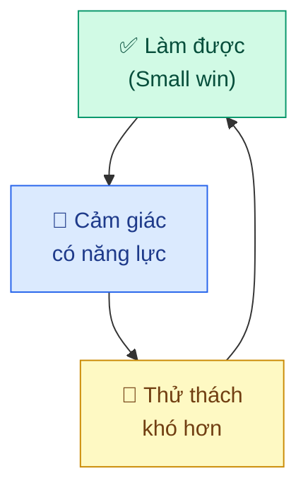
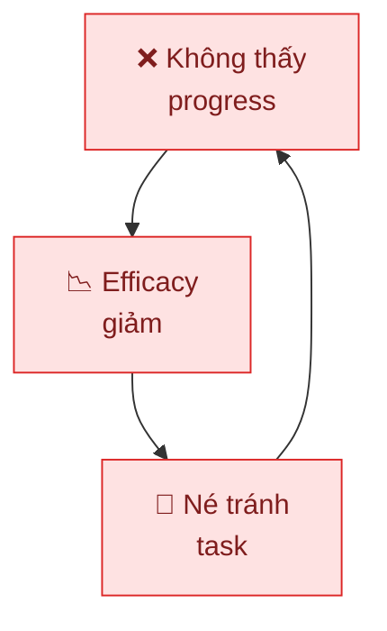
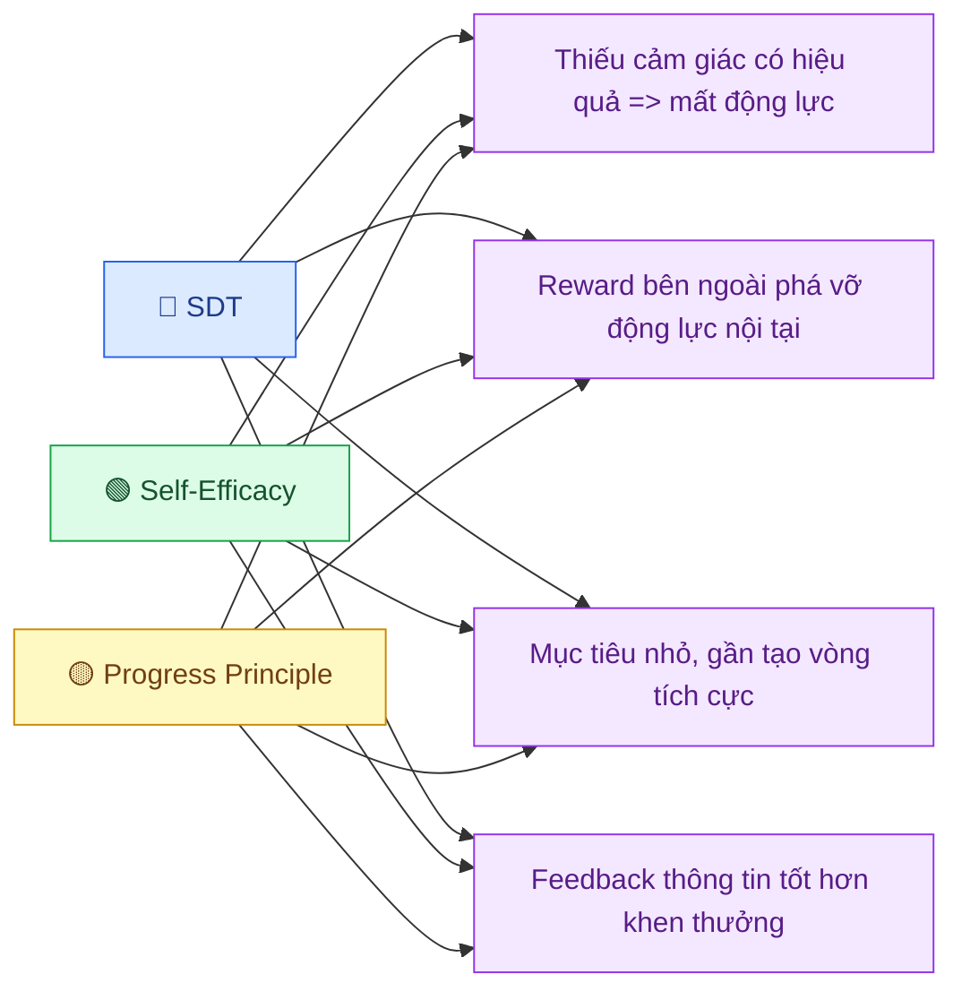

---
parents:
  - "[[Metalearning.canvas]]"
tags:
  - Metalearning
  - Synthesis
publish: "true"
---
> [!NOTE]
> Ba lý thuyết: [[Self-Determination Theory|SDT]], [[Self-Efficacy]], [[The Progress Principle|Progress Principle]] — được xây dựng độc lập, từ các nhóm nghiên cứu khác nhau, trên các câu hỏi khác nhau. Nhưng khi đặt cạnh nhau, chúng hội tụ về **cùng một bộ cơ chế**. Đây là những điểm chung đó.

## 1. Cảm giác có năng lực

Ba lý thuyết nhưng đều có điểm chung là cảm giác này.

| Lý thuyết | Tên gọi | Cơ chế |
|---|---|---|
| SDT | **Competence need** | Cảm giác đang tiến bộ, làm chủ được thách thức |
| Self-Efficacy | **Mastery Experience** | Tự tay làm được → niềm tin tăng |
| Progress Principle | **Small wins** | Thấy mình đang đi về phía trước |

**bằng chứng rằng mình đang có hiệu quả** là nguồn động lực mạnh và bền nhất. Không phải lời khen, không phải phần thưởng mà là *cảm giác làm được*.

## 2. Ý nghĩa là điều kiện cần

| Lý thuyết          | Điều kiện                                                                                                       |
| ------------------ | --------------------------------------------------------------------------------------------------------------- |
| SDT                | **Autonomy**: hành động phải xuất phát từ bên trong, dù chỉ ở mức *identified* ("việc này quan trọng với mình") |
| Progress Principle | **Meaningful work**: progress trên công việc vô nghĩa gần như không tạo ra tác động                             |
| Self-Efficacy      | `Efficacy` trên task mình quan tâm tạo ra động lực mạnh hơn hẳn task bị giao                                    |

→ **Câu hỏi cần hỏi trước**: *"Tại sao điều này quan trọng với mình?"* 
- không phải để tự thuyết phục, mà để kiểm tra xem ý nghĩa có thật không.
-  Nếu không tìm được câu trả lời thật, cả ba cơ chế đều hoạt động kém.

## 3. Mục tiêu `nhỏ`, `gần`, `rõ ràng`

| Lý thuyết          | Bằng chứng                                                                   |
| ------------------ | ---------------------------------------------------------------------------- |
| Self-Efficacy      | mục tiêu *gần* → chuỗi mastery experiences → efficacy cao nhất               |
| Progress Principle | Small wins -> big milestones; task phải đủ nhỏ để hoàn thành trong một buổi. |
| SDT                | Competence bị phá vỡ khi task quá khó —> cần calibrate độ khó liên tục       |

→ Mục tiêu lớn tạo ra inspi ration, nhưng **mục tiêu nhỏ tạo ra động lực hàng ngày**. Chia nhỏ không phải kỹ thuật quản lý thời gian mà là thiết kế nhiên liệu tâm lý.

## 4. Phần thưởng bên ngoài phá vỡ cả ba cơ chế

| Lý thuyết          | Cơ chế phá vỡ                                                                                                                                                   |
| ------------------ | --------------------------------------------------------------------------------------------------------------------------------------------------------------- |
| SDT                | Reward được hứa trước → não tái phân loại hành động thành "làm để lấy thưởng" → Autonomy bị cắt đứt                                                             |
| Progress Principle | Managers xếp "công nhận/khen thưởng" là #1, nhưng data thực tế: progress là #1; khen thưởng gần cuối bảng                                                       |
| Self-Efficacy      | `Social persuasion` (lời khích lệ từ ngoài) là nguồn **yếu và bất ổn nhất** — nếu thất bại sau khi được khích lệ, efficacy giảm mạnh hơn cả không được khích lệ |

Phần thưởng bên ngoài không vô hại mà nó *thay thế* động lực nội tại. 

Feedback tốt nhất là **thông tin cụ thể về năng lực** 
- cách tiếp cận này hiệu quả vì ABC, nếu làm thêm được XYZ nữa thì còn tuyệt vời hơn. 
- chứ không phải đánh giá "tốt lắm", trao bằng khen…

## 5. Vòng lặp tự củng cố hoặc tự phá huỷ

Khi vòng lặp tích cực khởi động, cả ba cơ chế tự duy trì:

Ngược lại, khi vòng lặp tiêu cực bắt đầu:

**Điểm khởi động quan trọng hơn điểm duy trì.** 
- Khi mất động lực, câu hỏi không phải *"làm sao lấy lại hứng thú?"* mà là *"bước nhỏ nhất mình có thể làm xong hôm nay là gì?"* 
- một `small win` đủ để khởi động lại vòng tích cực.

## Bản đồ hội tụ

Ba lý thuyết độc lập, cùng hội tụ về 4 điểm chung:

