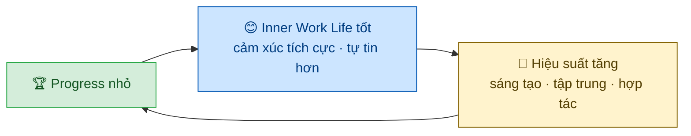
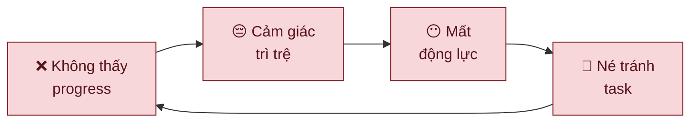

---
parents:
  - "[[Metalearning.canvas]]"
tags:
  - Metalearning
sources:
  - https://hbr.org/2011/05/the-power-of-small-wins
aliases:
  - Progress Principle
publish: "true"
---

> [!NOTE]
> **The Progress Principle**: trong tất cả những yếu tố tác động đến cảm xúc, động lực và nhận thức trong ngày làm việc, ***yếu tố quan trọng nhất*** là **cảm giác đang tiến về phía trước** trên **công việc có ý nghĩa**, dù chỉ là một bước nhỏ.

## Nghiên cứu nền tảng

Amabile & Kramer phân tích **12.000 nhật ký** của 238 người làm sáng tạo tại 7 công ty trong nhiều tháng. Mỗi ngày, người tham gia ghi lại sự kiện nổi bật nhất và trạng thái cảm xúc, động lực, nhận thức của mình.

Mục tiêu: tìm ra điều gì thực sự tạo ra **"Inner Work Life"** tốt — trạng thái bên trong quyết định chất lượng làm việc từng ngày.

Kết quả: progress trong công việc có ý nghĩa xuất hiện trong **76% các ngày được đánh giá là ngày tốt nhất** của người tham gia. Không phải khen thưởng, không phải tiền, không phải sự công nhận — mà là cảm giác *đang đi về phía trước*.

## Tại sao "small wins" mạnh hơn bạn nghĩ

> [!important]
> Tác động của progress **không tỉ lệ thuận với kích thước của nó**. Một bước nhỏ hoàn thành được — một đoạn code chạy, một đoạn văn viết xong, một khái niệm cuối cùng cũng hiểu ra — tạo ra làn sóng cảm xúc tích cực và động lực đủ để duy trì suốt ngày.

Cơ chế có hai vòng:

**Vòng tích cực — Reinforcing loop:**

**Vòng tiêu cực — Downward spiral:**

> [!example]
> Hai người học lập trình cùng nội dung, cùng thời gian. Người A chia nhỏ thành các task có thể hoàn thành trong một buổi (viết một function, pass một test). Người B học theo chương — chỉ thấy "xong" sau nhiều ngày. Người A có nhiều "small wins" hơn mỗi ngày → cảm giác tiến triển liên tục → bền hơn qua các giai đoạn khó.

## Điểm mù phổ biến

Amabile & Kramer hỏi các quản lý cùng nhóm nghiên cứu: *"Điều gì động viên nhân viên hiệu quả nhất?"*

Kết quả xếp hạng của quản lý:
1. Công nhận thành tích
2. Khuyến khích
3. Áp lực tiến độ
4. Phần thưởng
5. **Progress rõ ràng** ← xếp **cuối cùng**

Trong khi đó, dữ liệu thực tế từ nhật ký nhân viên: **progress xếp số 1**, cách xa các yếu tố còn lại.

> [!warning]
> Đây không chỉ là lỗi của quản lý — đây là lỗi nhận thức phổ biến về động lực. Chúng ta thường nghĩ động lực đến từ *phần thưởng bên ngoài* (khen ngợi, tiền, công nhận), trong khi thực ra nó đến từ *cảm giác có hiệu quả* — đang tiến về phía trước trên thứ mình quan tâm.

---

## Meaningful Work — Điều kiện cần

Progress chỉ tạo ra động lực khi công việc **có ý nghĩa với người làm**. 
- Progress trên công việc vô nghĩa → gần như k có tác động đến `Inner Work Life`
- Progress trên công việc có ý nghĩa → tác động mạnh và bền

*Ý nghĩa* không cần phải là sứ mệnh lớn lao — chỉ cần người làm thấy **kết quả của mình có tác động đến điều gì đó mình quan tâm**: chất lượng sản phẩm, sự phát triển của bản thân, đóng góp cho nhóm.

> Đây là lý do tại sao [[Self-Determination Theory|identified regulation]] là điều kiện để Progress Principle hoạt động — nếu bạn không thực sự quan tâm đến công việc, progress trên đó không tạo ra nhiều ý nghĩa.

---

## Ứng dụng vào học tập

**Thiết kế để thấy progress mỗi ngày:**
- Chia mục tiêu lớn thành task có thể hoàn thành trong một buổi học
- Dùng checklist không phải để kiểm soát mà để *thấy* mình đã đi được bao xa
- Kết thúc mỗi buổi học bằng câu hỏi: *"Hôm nay mình đã tiến thêm được điều gì?"*

**Tránh vô hình hóa progress:**
- Học liên tục mà không có điểm dừng để nhìn lại → não không ghi nhận được progress → động lực giảm dần dù thực tế đang học tốt

**Khi mất động lực** — thường không phải vì không thích chủ đề, mà vì không thấy mình đang đi về đâu. Cách kiểm tra: *"Bước nhỏ nhất mình có thể hoàn thành hôm nay là gì?"* — một bước nhỏ đủ để khởi động lại vòng tích cực.

---

## Liên hệ

- **[[Self-Efficacy]]** 
	- mỗi `small win` là một Mastery Experience: progress nhỏ → self-efficacy tăng → tiếp tục cố gắng; 
	- hai cơ chế củng cố lẫn nhau

- **[[Self-Determination Theory]]** 
	- progress thỏa mãn Competence need; 
	- meaningful work thỏa mãn Autonomy need; 
	- cả hai là điều kiện để Progress Principle phát huy tác dụng

- **[[Dopamine]]** — hoàn thành một task nhỏ giải phóng dopamine; thiết kế chuỗi small wins = thiết kế chuỗi dopamine lành mạnh
- **[[Chunking]]** — chia nhỏ kiến thức thành chunks có thể nắm được = tạo ra nhiều điểm progress hơn trong quá trình học
- **[[Procrastination]]** — procrastination thường là hậu quả của việc không thấy progress: task quá lớn, không biết bắt đầu từ đâu → không có small win → né tránh
- **[[Flow theory]]** — Flow và Progress Principle cùng yêu cầu mục tiêu rõ ràng và feedback tức thì; progress là nhiên liệu của Flow
- **[[Deliberate Practice]]** — Deliberate Practice cung cấp feedback ngay lập tức sau mỗi lần thử → tạo điều kiện nhận ra progress liên tục
