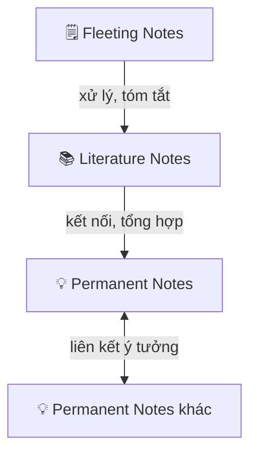

---
parents:
  - "[[🌏MOCs/Metalearning.canvas]]"
tags:
  - Metalearning
sources:
  - https://tuanmon.com/nguyen-tac-co-ban-zettelkasten/
banner: https://sii.pl/blog/wp-content/uploads/2023/08/Zdjecie-2-Zettelkasten-Luhmanna.jpg
publish: true
---

> [!NOTE]
> Zettelkasten là hệ thống ghi chú của **Niklas Luhmann**: nhà xã hội học Đức xuất bản hơn 70 cuốn sách trong đời: dựa trên nguyên tắc: **liên kết ý tưởng, không lưu trữ thông tin**.

Hai nguyên tắc cốt lõi tạo nên sức mạnh của hệ thống Zettelkasten:

1. **[[Atomic Notes]]** — mỗi ghi chú chỉ chứa một ý tưởng duy nhất
2. **[[Liên kết ý tưởng]]** — kết nối theo concept cụ thể, không theo chủ đề chung

---

## Ba loại ghi chú

### 1. Fleeting Notes: Ghi chú tức thời

Ghi nhanh bất kỳ ý tưởng nào vừa nảy ra: khi đọc, khi nghe, khi tự nghĩ. Không cần hoàn chỉnh, chỉ cần đủ để gợi lại sau.

> Công cụ: điện thoại, giấy, bất cứ thứ gì tiện tay.

### 2. Literature Notes: Ghi chú từ nguồn

Khi đọc sách hoặc bài báo và gặp ý tưởng đáng giữ lại:
- **Tóm tắt ngắn bằng lời của mình**: không copy nguyên văn
- **Ghi nguồn** để truy lại được
- **Thêm suy nghĩ riêng** nếu có

> Ví dụ: Đọc về Evernote, thấy cụm "product-market fit" → viết lại định nghĩa theo cách mình hiểu + ghi nguồn bài.

### 3. Permanent Notes: Ghi chú vĩnh viễn

Là **ý tưởng của chính mình**, được rút ra từ quá trình đọc và kết nối các Literature Notes lại với nhau. Khác với Fleeting Notes ở chỗ nó được liên tục cập nhật và củng cố theo thời gian.

> Ví dụ: Sau khi quan sát nhiều trường hợp → viết permanent note: *"Con người muốn biết sự thật, nhưng không thích sự thật trần trụi"* → tiếp tục bổ sung dẫn chứng hoặc phản biện về sau.

---

## Luồng xử lý

Permanent Notes là nơi kiến thức thực sự được xây dựng: không phải tích lũy thông tin, mà tích lũy **luồng suy nghĩ**.
